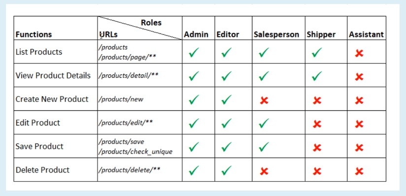

# Application Architecture

Admin App: Admin Code; Admin Dependencies

Shopping App: Shopping Code; Shopping Dependencies

Common Part: Common Code; Common Dependencies

View(Thymeleaf, HTML) <----> Controller(MVC, REST) <----> Service(business class) <----> Repository(Entities & Interfaces) <----> Spring Data JPA <----> Hibernate framework <----> JDBC Driver <---> Database


# Code Refactor 1

- Refactor code in users.html(URLs in table header and pagination)

# User Authentication
Using correct email and password to login.

# Code Refactor 2
- Create Thymeleaf fragments for page's head, navigation menu and footer
- Move common Javascript code to common.js  

Reduce code duplication, increase code readability and maintainability 

# User Authorization
Different roles have different functionalities.

# User Authorization: Access Rights Table


```html
<li class="nav-item" sec:authorize="hasAuthority('Admin')">
    <a class="nav-link" th:href="@{/users}">Users</a>
</li>
```

# Code Refactor 3

- Organize some Java packages(user export and user controllers)
- Organize some HTML pages(user module)
- Move some common Javascript code to a sepatate JS file

# Show Custom Error Pages

- To show user-friendly error messages instead of default technical ones
- Make UI of error pages match UI of the application
- Handle HTTP error codes: 403, 404, and 500
  403: Sorry, you don;t have permission to access this page
  404: Sorry, the requested page could not be found
  500: Sorry, the server has encountered an error while processing your request

- General custom error page
  Sorry, an unexpected error has occurred 

We don't have to write code or configure for handle the error URL, as it is convention defined by Spring: Just put the error pages in the right folder with the right names, it will work. So developers could focus on business logics, not wasting much time for configuration.

# Category Module


# Check Uniqueness of Category


## Why we need to mock a class when we do a unit test?

Mocking technique is primarily used during testing, as it allows us to take out certain aspects of the tested system, 
thus narrowing the test's focus and decreasing the test's complexity.

## Mockito
Mockito is an open-source testing framework used for unit testing of Java applications. 
It plays a vital role in developing testable applications. 
Mockito is used to mock interfaces so that a dummy functionality can be added to a mock interface that can be used in Unit Testing. 
Unit Testing is a type of software testing in which individual components of the software are tested.
The major objective of using the Mockito framework is to simplify the development of a test by mocking external dependencies and using them in the test code. 
And as a result, Mockito provides a simpler test code that is easier to understand, more readable, and modifiable. 
Mockito can also be used with other testing frameworks like JUnit and TestNG. 
JUnit framework is a Java framework that is also used for testing. 
Now, JUnit is used as a standard when there is a need to perform testing in Java

Because we just want to test the service layer, not the repository layer, that's why we use a mockito that allows us to get a fake for the area we don't want to 


# Delete Category Function

Only the category which has no children can be deleted

# Code Brand Module


# Code Authorization for Product Module



# KeyNotes 6:

- Map a bidirectional one-to-many entity relationship (Product and ProductImage) using @OneToMany, @ManyToOne and @JoinColumn
- cascade = CascadeType.ALL -> all changes to parent (Product) will update children (ProductImage)
- orphanRemoval = true -> delete children that are on longer referenced by the parent

## jQuery 

Change HTML document dynamically
 
- element.append(htmlCode) -> append HTML code to an element
- element.remove() -> delete the element from document tree

## Database design

- Add new colum all_parent_ids to categoriesTable -> make it easy for searching products in a category and its sub categories.

## Thymeleaf

Use boolean expression for HTML attributes:
- th:selected="${expression}"
- th:readonly="${expression}"
- th:disabled="${expression}"

Expression for authorization
- ${#authorization.expression('hasAuthority("Salesperson")')}